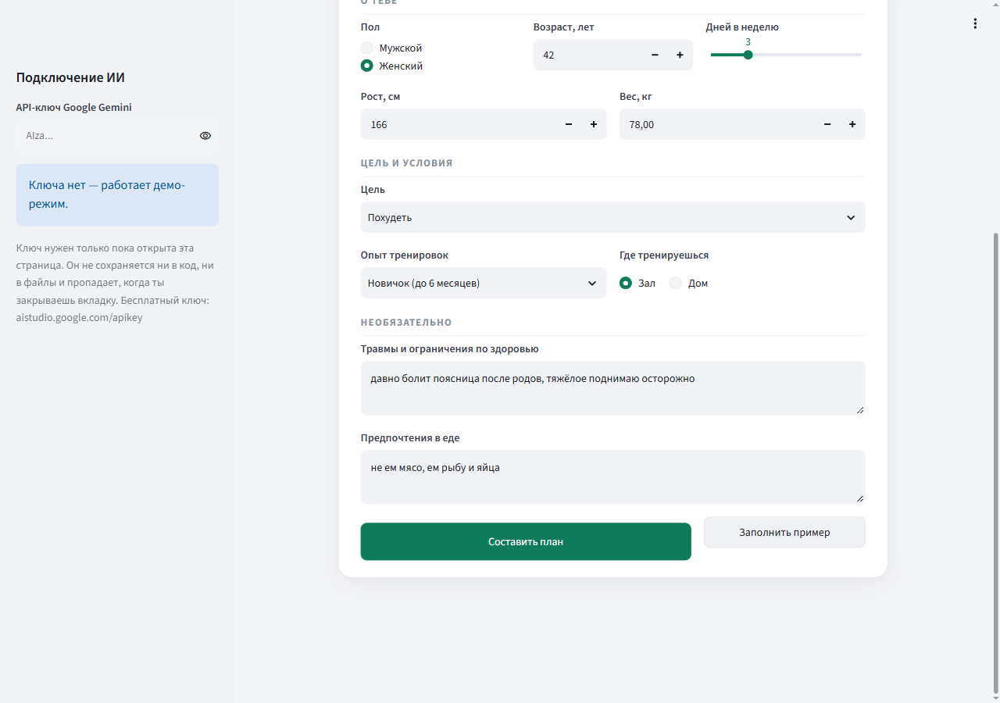
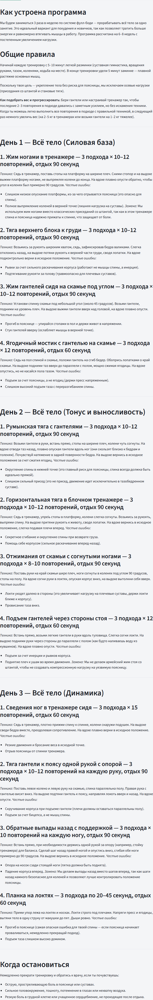
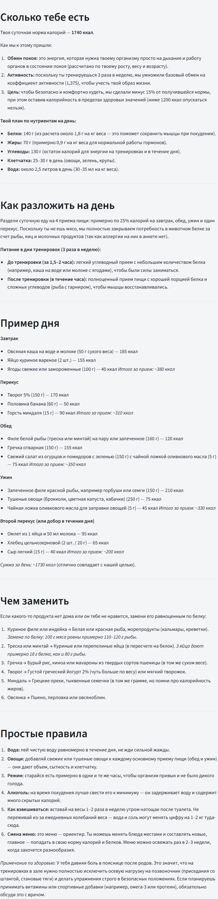

# Фитнес-агент

Веб-приложение, которое по короткой анкете составляет человеку программу
тренировок и план питания: проверяет анкету на противопоказания, подбирает
упражнения с техникой и типичными ошибками, считает калории и собирает меню.

## Зачем это нужно

Человек, который впервые пришёл в зал, обычно остаётся один на один с двумя
вопросами: что делать на тренировке и как теперь питаться. Готовые программы
из интернета написаны «для всех сразу» — они не знают ни про больную поясницу,
ни про то, что человек не ест мясо, ни про то, что свободных дней всего три.
Персональный тренер эти вопросы закрывает, но стоит денег и есть не у каждого.
Приложение занимает нишу между этими вариантами: за минуту заполнения анкеты
человек получает план, собранный под его цель, опыт, ограничения по здоровью
и предпочтения в еде, с объяснением каждого решения — почему именно такой
сплит, почему одно упражнение заменено другим, откуда взялась норма калорий.
Отдельно решается вопрос безопасности: если по анкете видно, что заниматься
самостоятельно рискованно, приложение не выдаёт план, а отправляет к врачу.

## Как работает

```
Анкета  →  Проверка безопасности  →  Тренировки  →  Питание  →  Готовый план
```

1. **Анкета.** Пользователь заполняет форму: пол, возраст, рост, вес, цель,
   опыт, сколько дней в неделю готов заниматься, зал или дом, а также два
   необязательных поля своими словами — травмы и предпочтения в еде.

2. **Проверка безопасности.** Модель оценивает, можно ли человеку заниматься
   без осмотра врача, и возвращает один из трёх статусов:
   `ok` — ограничений нет, `caution` — заниматься можно с оговорками,
   `stop` — сначала к врачу. Ответ приходит строго по заданной схеме,
   поэтому приложение разбирает его без догадок.

3. **Тренировки.** Если статус не `stop`, модель составляет программу по общим
   рекомендациям ВОЗ и ACSM: сплит под число дней, упражнения с подходами,
   повторениями и отдыхом, техника и частые ошибки по каждому движению.
   Опасные при указанных травмах упражнения заменяются, замена поясняется.

4. **Питание.** Норма калорий считается по формуле Миффлина — Сан Жеора
   с коэффициентом активности и поправкой на цель, дальше раскладывается
   на белки, жиры и углеводы, приёмы пищи, меню на день и замены продуктов —
   с учётом предпочтений в еде.

5. **Готовый план.** Тренировки и питание показываются на двух вкладках.
   Весь план можно скачать одним файлом `.md`.

При статусе `stop` шаги 3 и 4 не выполняются: вместо плана человек видит
совет, к какому врачу обратиться и что у него спросить.

## Как выглядит

Анкета. Кнопка «Заполнить пример» подставляет готовые ответы, чтобы
не придумывать данные:



Готовый план на двух вкладках — «Тренировки» и «Питание».

Вкладка «Тренировки» — сплит на все дни недели, по каждому упражнению подходы,
повторения, техника и частые ошибки:



Вкладка «Питание» — норма калорий с расчётом, нутриенты, меню на день и чем
заменить продукты:



## Установка

Нужен Python 3.10 или новее. Проверить, что он есть: `python --version`
(на macOS — `python3 --version`). Если команда не найдена, скачай Python
с python.org и при установке на Windows поставь галочку «Add Python to PATH».

### Windows (PowerShell)

```powershell
# 1. Перейти в папку проекта
cd путь\к\fitness-agent

# 2. Создать виртуальное окружение — отдельную папку для библиотек проекта
python -m venv venv

# 3. Включить его. В начале строки появится (venv)
venv\Scripts\Activate.ps1

# 4. Установить библиотеки
pip install -r requirements.txt
```

Если шаг 3 ругается на запрет выполнения скриптов, разреши их для текущего
пользователя и повтори:

```powershell
Set-ExecutionPolicy -Scope CurrentUser RemoteSigned
```

### macOS (Terminal)

```bash
# 1. Перейти в папку проекта
cd путь/к/fitness-agent

# 2. Создать виртуальное окружение
python3 -m venv venv

# 3. Включить его
source venv/bin/activate

# 4. Установить библиотеки
pip install -r requirements.txt
```

## Запуск

```bash
streamlit run app.py
```

Браузер откроется сам на http://localhost:8501. Пока окно терминала открыто,
приложение работает; остановить — `Ctrl + C`.

При следующем запуске шаги установки не нужны — достаточно включить окружение
(`venv\Scripts\Activate.ps1` или `source venv/bin/activate`) и выполнить
`streamlit run app.py`.

## Ключ Gemini и демо-режим

### Демо-режим: без ключа

Приложение работает сразу, без всякой настройки. Вместо обращения к модели
оно показывает заранее записанные ответы из `examples/demo_responses/` —
это настоящие ответы Gemini на анкету `examples/sample_profile.json`,
сохранённые одним прогоном. Приложение честно предупреждает, что это
сохранённый пример для другой анкеты, а не ответ на введённые данные.

Такой режим удобен, чтобы посмотреть проект целиком, ничего не регистрируя.

### Боевой режим: со своим ключом

1. Открой https://aistudio.google.com/apikey и войди в аккаунт Google.
   Банковская карта не нужна — тариф бесплатный.
2. Нажми «Create API key» и скопируй ключ целиком.
3. Вставь его в поле **«API-ключ Google Gemini»** в левой панели приложения.
   Поле скрывает ввод точками, как пароль.

Ключ нигде не сохраняется: ни в коде, ни в файлах, ни в переменных окружения.
Он живёт только в памяти открытой вкладки и пропадает при её закрытии —
в следующий раз его нужно ввести заново. Это осознанное решение: ключ
не лежит на диске.

### Принудительный демо-режим

Если нужно показывать приложение, не тратя бесплатные запросы, скопируй
`.env.example` в `.env` и поставь `DEMO_MODE=true`. Тогда пример показывается
всегда, даже с введённым ключом. Файл `.env` в репозиторий не попадает.

### Бесплатный лимит

У бесплатного тарифа есть предел запросов в минуту и в сутки. Один план —
это три запроса (проверка, тренировки, питание). Если лимит исчерпан,
приложение скажет об этом словами и предложит подождать. Суточный лимит
обнуляется в полночь по тихоокеанскому времени.
Актуальные цифры: https://ai.google.dev/gemini-api/docs/rate-limits

## Пример сценария

Нажми «Заполнить пример» — подставится анкета из `examples/sample_profile.json`:

| Поле | Значение |
| --- | --- |
| Пол, возраст | женский, 42 года |
| Рост, вес | 166 см, 78 кг |
| Цель | похудеть |
| Опыт | новичок (до 6 месяцев) |
| Дней в неделю | 3 |
| Место | зал |
| Травмы | давно болит поясница после родов, тяжёлое поднимаю осторожно |
| Еда | не ем мясо, ем рыбу и яйца |

После нажатия «Составить план» получится следующее (это настоящий ответ
модели, он и лежит в `examples/demo_responses/`):

**Проверка безопасности** — статус `caution`: «есть хронический дискомфорт
в пояснице, поэтому нужно подобрать упражнения с осторожностью и исключить
осевую нагрузку на позвоночник».

**Тренировки** — фулбоди три раза в неделю на 6–8 недель. Приседания со штангой
и становая тяга исключены как осевая нагрузка; вместо них жим ногами в тренажёре
(«в этом тренажёре спина прижата к спинке»), тяга верхнего блока, жим гантелей
сидя, ягодичный мостик. По каждому упражнению — подходы, повторения, отдых,
техника и частые ошибки.

**Питание** — 1740 ккал в сутки: белки 140 г, жиры 70 г, углеводы 130 г,
четыре приёма пищи. Меню собрано без мяса — на рыбе, яйцах и твороге,
с объяснением, чем закрывается белок.

**Скачать план** — файл `moy-plan.md` примерно на 12 тысяч знаков: анкета,
результат проверки, обе части плана и предупреждение.

Чтобы получить план под свои данные, заполни анкету своими ответами
и введи ключ Gemini в левой панели.

## Технологии

| Что | Зачем |
| --- | --- |
| Python 3.10+ | язык проекта |
| Streamlit | интерфейс: форма, вкладки, кнопки — без отдельного фронтенда |
| google-genai | официальная библиотека Google для Gemini API |
| python-dotenv | чтение настроек из файла `.env` |
| Gemini `gemini-3.5-flash-lite` | модель на бесплатном тарифе Google AI Studio |

Название модели задано одной константой `MODEL` в начале `agent/llm.py` —
чтобы перейти на другую, меняется одна строка. Более умная `gemini-3.8-flash`
тоже бесплатна, но на бесплатном тарифе чаще отвечает «модель перегружена».

## Структура проекта

```
app.py                       — интерфейс: анкета, ключ в боковой панели, вывод плана
.streamlit/config.toml       — цвета темы и настройки запуска
.env.example                 — образец файла настроек (DEMO_MODE)
agent/llm.py                 — единственное место, где вызывается модель
agent/pipeline.py            — цепочка шагов и чтение сохранённых ответов
agent/prompts/safety.md      — промпт проверки безопасности
agent/prompts/workout.md     — промпт программы тренировок
agent/prompts/nutrition.md   — промпт плана питания
examples/sample_profile.json — анкета-пример для кнопки «Заполнить пример»
examples/demo_responses/     — записанные ответы модели на эту анкету
scripts/zapisat_demo.py      — разовый прогон, который эти ответы записывает
screenshots/                 — скриншоты для этого файла
requirements.txt             — список библиотек
```

Весь код работы с моделью собран в `agent/llm.py`: в остальных файлах нет
ни импорта `google.genai`, ни названия модели. Тексты промптов вынесены
в отдельные файлы `agent/prompts/`, а не вшиты в код строками, — их можно
править, не трогая программу.

### Как обновить демо-ответы

Если промпты заметно изменились, сохранённые ответы стоит перезаписать:

```bash
python scripts/zapisat_demo.py
```

Скрипт спросит ключ скрытым вводом (или возьмёт из переменной окружения
`GEMINI_API_KEY`), прогонит все три шага на `sample_profile.json` и сохранит
три файла. В файлы проекта ключ не попадает.

## Ограничения

**Это не медицинская консультация.** План составляет языковая модель
по общим рекомендациям ВОЗ и ACSM. Она не ставит диагнозов, не видит человека
и не заменяет врача или тренера. Проверка анкеты — не медицинский скрининг,
а грубый фильтр, который в спорных случаях выбирает более осторожный вариант.
При любых сомнениях о здоровье нужно идти к врачу, а не к приложению.

**Не вводите в анкету настоящие данные о здоровье.** Проект работает
на бесплатном тарифе Google AI Studio, а у него отдельные правила обработки
данных: присланные запросы могут использоваться для улучшения сервиса
и просматриваться людьми. Для учебной демонстрации это допустимо, для
реальных диагнозов — нет. Указывайте вымышленные или обобщённые сведения.

**Ответ модели может быть неточным.** Арифметика в калориях иногда
расходится на несколько десятков килокалорий, а формулировки от запуска
к запуску меняются. План стоит читать как черновик, а не как предписание.

## Развитие проекта

- **Рассылка анкет клиентам.** Сейчас анкета заполняется в самом приложении.
  Логичный следующий шаг — отдавать клиенту ссылку на форму, получать ответы
  и собирать план без участия тренера в заполнении.
- **Дополнительные проверки.** Отдельным шагом проверять уже готовый план:
  сходится ли арифметика калорий, не попали ли в программу упражнения,
  запрещённые при указанных травмах, выдержан ли отдых между тренировками
  одной группы мышц.
- **Экспорт в PDF.** Сейчас план скачивается в Markdown. PDF с вёрсткой
  удобнее печатать и отдавать клиенту.
- **История планов.** Сохранять составленные планы, чтобы возвращаться
  к ним и сравнивать с предыдущими.

## Об авторстве кода

Код проекта написан с помощью Claude Code — агента Anthropic, работающего
в терминале. Архитектура, промпты и правила проекта задавались автором,
Claude Code писал по ним код, а каждый шаг проверялся запуском приложения
в браузере. Правила, по которым велась работа, лежат в `CLAUDE.md`.
